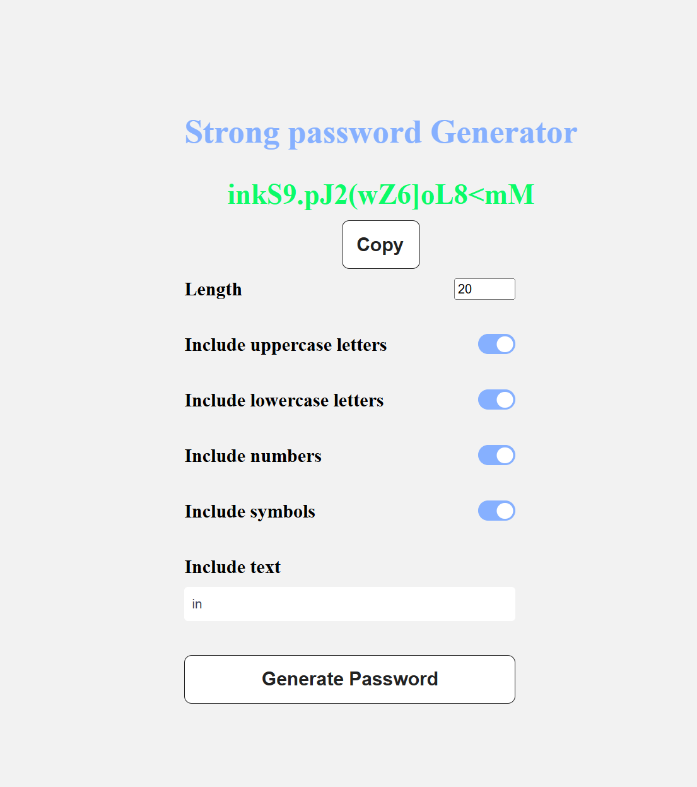

# Random Password Generator

**A simple and fun project that generates secure random passwords using HTML, CSS, and JavaScript.**  
This project allows users to create customized passwords based on selected criteria.



## Features
- **Customizable Password Generation**: Specify the length and character types (uppercase, lowercase, numbers, and symbols) for the password.
- **Dynamic Content**: The generated password is displayed instantly upon creation.
- **Clipboard Functionality**: Easily copy the generated password to your clipboard with a button click.
- **Error Handling**: Alerts the user if there is an attempt to copy an empty password.

## Description
This project provides a user-friendly interface for generating secure passwords. Users can select options for password length and desired character types, including:
- Lowercase letters
- Uppercase letters
- Numbers
- Symbols
- Text

Upon clicking the "Generate Password" button, a new password is created based on the selected options and displayed on the screen. Users can also copy the generated password to their clipboard with a dedicated button, receiving confirmation via an alert.

The project uses:
- **HTML** for structure
- **CSS** for styling and layout
- **JavaScript** for password generation logic and user interaction management

## Prerequisites
Before running this project, ensure you have a basic understanding of the following technologies:
- **HTML**: For structuring the user interface of the password generator.
- **CSS**: For styling the interface and providing an appealing layout.
- **JavaScript**: For handling password generation and user interactions.

## How to Use
1. Open the `index.html` file in your web browser.
2. Select the desired password length and the types of characters to include.
3. Click the "Generate Password" button to create a new password.
4. The generated password will be displayed on the screen.
5. Click the "Copy to Clipboard" button to copy the password. An alert will confirm the action.
6. If no character types are selected, a default password will be generated based on the specified length.

## Installation
To run this project locally:
1. Clone the repository or download the files.
2. Open `index.html` in any web browser.

### Installation Instructions
1. Clone the repository:
    ```bash
    git clone https://github.com/yourusername/password-generator.git
    ```
2. Navigate to the project directory:
    ```bash
    cd password-generator
    ```
3. Open `index.html` in a web browser.

## Author
- Basset Gaëtan (@[gbasset](https://github.com/gbasset))